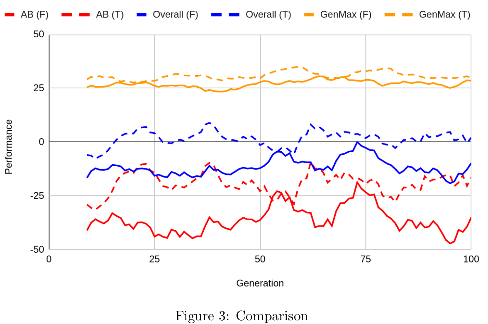

# othello-tensorflow
I used tensorflow to experiment with creating a agent to play Othello.

## Experiment 1: Image Recognition training ()

We measured the performance of agents whom learned to associate boardstates with the score of the players whom made them. We found that using different styles of generating these images leads to an overall better agent. However, the player is unable to keep up with players implementing alpha-beta pruning. It should be noted that the best player throughout the experiments could best alpha-beta players looking 3 moves ahead.

